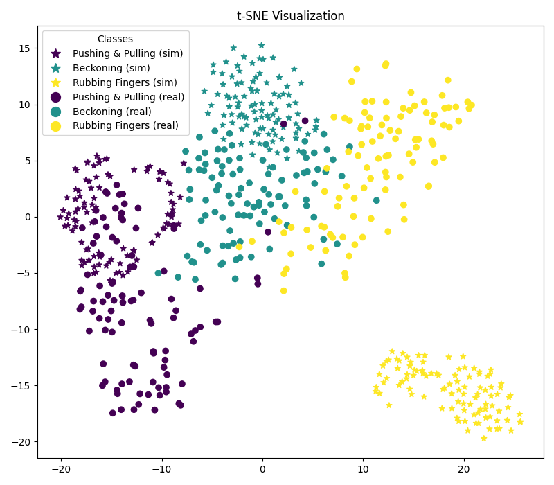
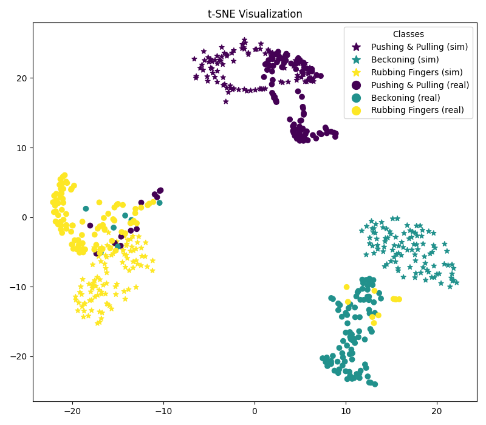

# spectrogram_TF

Unsupervised adversarial domain adaptation for spectrogram images (`simulation` to `reality` transfer learning).

<table>
<thead>
  <tr>
    <th></th>
    <th>Source Only</th>
    <th>Domain Adptation</th>
  </tr>
</thead>
<tbody>
  <tr>
    <td>Test Accuracy</td>
    <td>90.8%</td>
    <td>94.1%</td>
  </tr>
  <tr>
    <td>Confusion Chart</td>
    <td></img></td>
    <td></img</td>
  </tr>
  <tr>
    <td>TSNE for test</td>
    <td></td>
    <td></td>
  </tr>
  <tr>
    <td>TSNE for all</td>
    <td></td>
    <td></td>
  </tr>
</tbody>
</table>